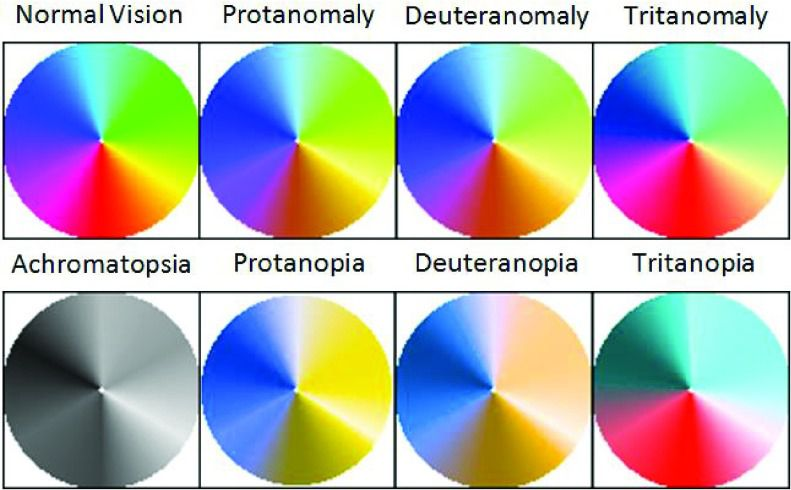

# Color Blindness Palette Optimizer

## Description

### Developer

Anh Tran

### Program Purpose

This is a C++ program that can optimize a color palette obtained from the user’s RGB inputs, thereby maximizing the percentage of people who will be able to easily differentiate the colors in the palette.

### Disclaimer

I wrote this program for a beginner CS college class during the Fall of 2023 in Replit. Therefore, I cannot guarantee that everything will work like how I tested multiple times on Replit. I will try to fix it as I learn more about programming in the future.

## Updates
### v1.0

This program will prompt the user for a palette consisting of 3 different colors in RGB format from the terminal screen, then let the user choose from 3 different brightness levels for each color and adjust them accordingly to optimize the number of people who will be able to easily detect the differences.

My idea came from [this thread](https://stackoverflow.com/questions/50937550/formula-to-increase-brightness-of-rgb) on Stack Overflow.

### v2.0

For the second update, I keep the brightness adjustment feature for 3 or fewer input colors and upgrade my program with the ability to process up to 9 colors by grouping similar colors into 3 groups, redistributing the colors so that no group has more than 3 colors and adjusting their brightness so that as many people can differentiate them as possible.

The way the colors-grouping mechanism works was inspired by the picture below. Through some observations of the color wheel, I have concluded that for most colorblind people, colors can be sorted into 3 main groups - Purple-to-Yellow, Yellow-to-Cyan, and Cyan-to-Purple - where all colors that are in the same group look similar to each other in the eyes of a colorblind person.

After grouping the colors, their brightness levels would be adjusted so that they no longer look similar to each other.



### v3.0

For the last update, I have fixed a major bug that I didn't notice in the previous update - my program didn't categorize and sort the colors correctly, which resulted in it throwing away half of the colors the user entered and creating duplicates of the other half. The categorize() function (line 147) now works as I intended.

I also adjusted the input prompt loop so that the program will keep asking for input unless it has at least 2 colors since its purpose would be quite meaningless with only 1 or no colors at all.

Last but not least, I've created a new class called "color" that serves as a separate library used in processing colors in RGB and HSL color spaces for my program. This class can also be used in my future projects as well.

## Getting Started

First, compile the program using the command:

```g++ main.cpp color.cpp -std=c++17 -o cvp```

Then run the program:

```./cvp```

When the program runs, do the following:

1. Enter the Red, Green, and Blue values for each color. Make sure to enter values that fall within the interval of 0-255, at least 2 colors, and no more than 9 colors. If you enter values out of this range, the program will quit the input-receiving phase and start to make adjustments to the previous inputs.

2. The program should give you the output as a separate file named "Optimized palette.txt" with a list of RGB values of the adjusted colors, with 3 different levels of brightness and different hues so that most colorblind people can differentiate the colors.

## Demonstration

### Console Input


### Output File


## C++ Concepts

The following sections describe how C++ concepts have been used in this program.

### Variables and Data Types

1. The variable "r" (declared in line 24) is used as the medium for the user to enter the input for the Red value of each color, and later on its value will be validated and stored in the "red" member variable of the variable "input" of the class "color", which will be used in the adjustment process. "r" is an int because RGB values are integers.

2. The double vector "standardLight" (declared in line 29) is used as the list of the 3 default brightness levels set by the program itself used in the adjustment process. It's a double vector because the brightness level, also defined as the lightness (L) value in the HSL color space is a decimal number. It's a constant vector because I set it as the standard brightness levels and don't want its values to change.

### Console Input/Output

1. In lines 32-40, the program prints out its use and the instructions for the user to enter the color input. These lines are important because they help the user understand what to do when the program starts.

2. In lines 50, 52, and 54, the user is asked to enter the values for the red, green, and blue components for each color. This is the most important information, without it, the program will not work since there are no colors to process to begin with.

### Decisions

1. In lines 56-60, an if-statement is used to validate the input RGB values and only allows the program to store the entered values to their respective red/green/blue member variables of a color input variable if the values are all within the range of 0-255. It is important that the entered values are within this interval since RGB values can't be outside of this range.

2. In lines 109-115, an else-statement is called only if the condition required for the previous if-statement in lines 74-108 isn't met. This else-statement is the condition for the program to print out the warning for the user if they enter more than 9 colors, and therefore, I think else would be a suitable choice in this case instead of another if-statement.

3. In lines 85-88 (color.cpp), an else...if-statement is used to calculate the H values in the conversion of RGB to HSL. I used it because it was stated in [this conversion formula](https://www.rapidtables.com/convert/color/rgb-to-hsl.html) that the value of h depends on the value of delta and cmax. According to the formula, the values are calculated differently depending on the precondition, therefore we should use an else if-statement to evaluate different cases separately instead of using another if-statement and accidentally overwrite the previous calculations.

### Iteration

1. In lines 177-190, I use a while-loop in the redistribute() function to repeat the process until no group has more than 3 colors. A do...while-loop is unnecessary in this case because the values are already provided for the redistribution() function beforehand, therefore I only need a loop that can evaluate the preconditions right away instead.

2. I use a do...while-loop in lines 44-66 to prompt the user for the RGB values over and over again until the user wants to quit or reaches the limit of 9 colors. The reason I want to use a do...while-loop instead of a while-loop is because the "cin" statements are integrated into the loop so that my program can keep asking the user for input and I don't want to reuse the codes in the lines 45-54 outside of the loop.

3. In lines 245-248, I use a for-loop to gradually write out the result to a text file, the number of loops depends on the size of the "colorList" vector, which represents the number of colors the program deals with. I find a for-loop extremely useful in this case since a for-loop is more concise than a while-loop or do...while-loop when we want to print out a list.

### Functions

1. In lines 120-130, the function isValidRGB() is defined with a bool return type. It, along with the isInRange() (lines 132-135) function, is used to determine whether the user's inputs for the RGB values of the colors are valid or not (each number should fall within the range of 0-255). The function is then called in lines 56 and 66, within the input prompt do...while-loop, to determine if the program should add the numbers to the color vectors or quit the input receiving phase.

2. In lines 236-255, the function result() is defined. It has no output, and is used to write out the final result palette to a separate text file named "Optimized palette.txt". The return type is a void because it only writes something out to a text file and doesn't need to return any value.

3. In the function catergorize() (defined in lines 147-172), I use pass-by-reference on all 4 parameters because I want to change all of them at the same time without the need to create 4 new variables and waste memory space. In this function, I want to divide all the colors within the vector "list" into 3 different groups based on their hues, and after categorizing the colors, I want to delete them from the list since those colors will go through various modifications before being returned to that list to be exported into a text file. I also defined the function with a void return type based on the aforementioned purposes.

### File Input/Output

I use _ofstream_ (line 238) to write out the results in a separate text file so that the user can access the data later on without having to run the program again.

### Classes

One class, which is the "color" class, was used in this project. A variable of this class can store RGB and HSL attributes, which are the 2 fundamental value sets of colors that I use in my project. Some explanations of how this class works:

1. It can store color attributes, including red, green, and blue shades, and the hue, saturation, and lightness of the color as member variables. These member variables are set private because their values should ONLY be changed the way I intended them to change, meaning, only their brightness can be changed, their hues can only be standardized to red, green, or blue, and only their hues, RGB and HSL values can be accessed from outside the class.

2. It has 2 private member functions called RGBtoHSL() and HSLtoRGB(). They are the conversion functions that are the backbone of various other member functions in this class. I don't want anyone to have access to these 2 functions outside of this class because tampering with them may result in errors in the program or incorrect conversions.

3. The class has 2 constructors, including a default one that automatically sets all attributes to 0, and an overloaded one that receives RGB values and sets the HSL values accordingly.

4. The class has other public member functions as well.
- changeBrightness() can change the brightness level of a color.
- standardizeHue() can set a color's hue to the set standard. This function is used in the main.cpp to adjust the colors.
- getRGB() and getHSL() return the attributes of the color in the format (a, b, c).
- getHue() returns the hue of the color as an integer.
